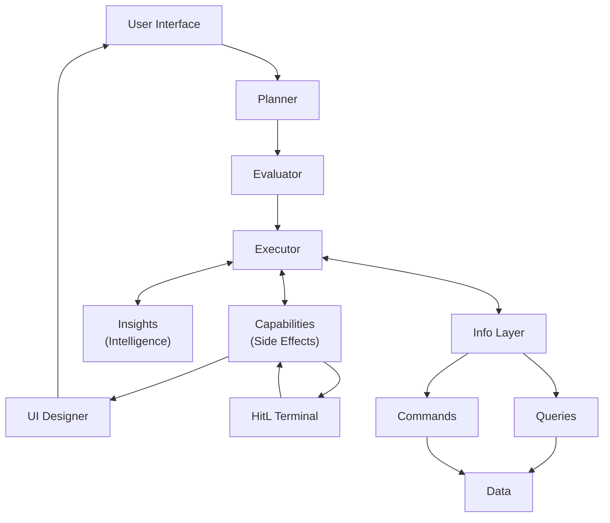
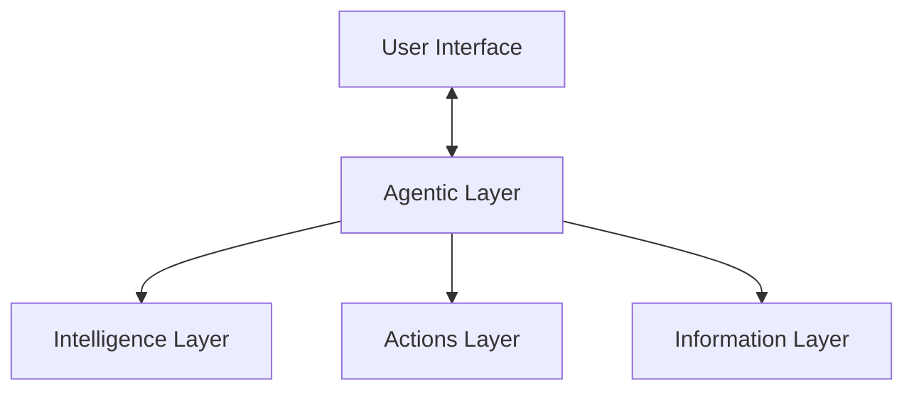

# The EaaPL System

The purpose of English as a Programming Language (EaaPL) is to make programming more accessible by allowing users to create designs and implement them using natural language. This approach enables individuals, even those without extensive programming knowledge, to communicate their goals clearly and have the system generate the required solution.

The concept of EaaPL was born out of the desire to simplify programming by leveraging natural language. Instead of requiring users to learn complex programming languages, EaaPL allows them to directly instruct the system in English a complex natural language. This bridges the gap between people with domain knowledge but no coding experience and software development, allowing them to contribute meaningfully to creating software solutions. It also emphasizes collaboration and creativity in problem-solving, removing the technical barriers that often hinder non-programmers.

Traditional programming languages, such as C++, Python, or JavaScript, have formal syntax and rules, which can be challenging for those without formal training. In contrast, EaaPL relies on natural language constructs, making it inherently more accessible. By transforming natural language into executable code, EaaPL utilizes advances in natural language processing (NLP) and artificial intelligence (AI) to understand and interpret instructions in a way that is intuitive for humans. This approach makes programming closer to how humans naturally think and communicate, focusing on the user's intent rather than technical details.

EaaPL leverages a fundamental concept in language theory called **semantic parsing**. Semantic parsing is the process of converting natural language into a structured form that a machine can understand. In EaaPL, this means breaking down English instructions into logical steps that can be executed by the system. Additionally, EaaPL treats English as a **declarative language**. This means users describe what they want to achieve, and the system takes responsibility for determining how to accomplish it. The focus is on "what" needs to be done, rather than "how" it needs to be done.

- **Programmer**: A person who writes a program.
- **Program**: A set of instructions written in natural language that tells the system what the user wants to accomplish.
- **Plan**: A detailed breakdown of the steps required to accomplish a program's goal, created by the Planner agent.
- **Implementation**: The process of turning a concept, design, or idea into a functioning system.

English is a natural language that can be used to create software via the English Execution Environment (EEE). This environment transforms natural language instructions into executable actions, effectively bridging the gap between human communication and software development.

## English Execution Environment (EEE)

The English Execution Environment (EEE) is responsible for executing user programs. It includes several key components that work together to ensure programs are carried out effectively:

- **Planner**: An agent that creates the plan for executing the program. The Planner takes the user's natural language request and breaks it down into detailed steps that the system can understand and execute.
- **Evaluator**: An agent that reviews the plan created by the Planner to verify that it can accomplish the intended goal. It also checks that the necessary system components are available and ready for execution.
- **Executor**: An agent that manages the system's state and carries out the steps defined in the plan by calling the necessary capabilities.
- **UI Designer**: An agent that determines how the User Interface (UI) should change during the program's execution, ensuring the user has a clear understanding of progress and outcomes.
- **Capabilities**: Any actions that the EEE can perform, such as sending an email or writing to a file. These are system-level functions that produce observable results.
- **Intelligence**: Pure functions that the Executor can run. These functions do not have side effects and are often used to transform data or compute values.
- **Output**: The interface where information is displayed for the user.
- **Input**: Where events or data are entered into the system by the user.
- **Terminal**: A display interface for the Human in the Loop (HitL), which allows a person to intervene when necessary.

The EEE relies on events to enable communication between these components, allowing each to contribute to the overall program execution seamlessly.

### Overall System Design

Below is a visual representation of the EEE system design, showing how each component interacts with the others:

### Simplified View of the System

To make it easier to understand, here is a simplified view of the EEE, grouped into layers:

From the user's perspective, they interact only with the UI. If they wish to engage with the lower-level system, that option should be available. However, ideally, the EEE handles everything seamlessly, and deeper engagement should not be necessary unless required. If users have to interact with lower-level components, this should be logged as an area for improvement.

### Walkthrough of Program Execution

Let's walk through an example of how a program is executed in the EEE system:

1. **User writes a program and executes it**: The user writes a simple program in natural language, such as: "Send an email to all my contacts that says 'Hello World!'" and executes it.

   Example: The user enters this command in the UI, and the EEE receives this input.

2. **Planner creates an execution plan**: The Planner translates the user's program into an execution plan.

   Example: The Planner breaks down the task into steps: (a) retrieve all contacts, (b) draft an email with the subject and content "Hello World!", (c) schedule email sending.

3. **Evaluator reviews the plan**: The Evaluator performs a system status check to ensure the necessary resources are available for execution.

   Example: The Evaluator verifies that the email capability is available, checks that the system is online, and confirms that the required permissions and configurations are in place for sending emails.

4. **Executor generates events**: The Executor generates the necessary events required by the plan.

   Example: The Executor triggers an event to retrieve the user's contact list from the data layer, another event to compose the email, and an event to send it.

5. **Info Layer provides information**: The Info Layer provides information defined by data commands and queries.

   Example: The Info Layer processes a query to fetch the contact list from the data layer. This information is then used in subsequent steps to draft the email.

6. **Insights handle data transformation**: Insights define how information should be transformed or combined.

   Example: Insights may optimize how the list of contacts is handled, removing duplicates or correcting formatting issues to ensure all contacts receive the email.

7. **Capabilities manage side effects**: Capabilities execute side effects, such as writing to disk, sending an email, or providing program output.

   Example: The Executor calls the capability to send an email. This capability handles connecting to the email server and sending the email to each contact.

8. **Human in the Loop (HitL) Terminal**: The HitL Terminal provides a point for human interaction when needed.

   Example: If there are any errors, such as missing email addresses or issues with the email server, the HitL Terminal alerts the user and provides options to resolve the issue manually.

9. **UI Designer displays output**: The UI Designer reads the output and displays it for the user based on their preferences.

   Example: Once the emails are successfully sent, the UI Designer displays a confirmation message to the user, including details such as the number of emails sent and any contacts that could not be reached.

## FAQ

**Q1: How will EaaPL handle the ambiguity of natural language?**

**A:** EaaPL relies on advanced natural language processing (NLP) to interpret user instructions. However, natural language is inherently ambiguous, and this remains a key challenge. We are working on improving context recognition and user feedback loops to clarify ambiguous commands, but some level of ambiguity may still require human intervention.

**Q2: Won't relying on Human in the Loop (HitL) make the system inefficient?**

**A:** HitL is designed as a safety net to handle cases where the system cannot fully understand or execute a command. While frequent human intervention would reduce efficiency, we aim to minimize the reliance on HitL through continuous improvements in NLP and contextual understanding. Over time, as the system learns from user interactions, the need for human involvement should decrease.

**Q3: How does EaaPL address the scalability concerns with multiple users?**

**A:** Scalability is a significant concern for EaaPL, especially with multiple users issuing commands simultaneously. So for now we are not addressing this.

**Q4: What are the initial limitations of EaaPL's capabilities?**

**A:** Initially, EaaPL will support basic capabilities, such as sending emails and handling file operations. While these are useful for everyday tasks, more complex programming scenarios will require significant development and expansion of capabilities. We are focusing on building a solid foundation that can be expanded over time to accommodate more sophisticated tasks.

**Q5: How will EaaPL ensure security when executing natural language commands?**

**A:** Security is a major concern when allowing users to write programs in natural language. We plan to implement strict input validation, permission controls, and sandboxing techniques to prevent harmful commands from being executed. Ensuring user safety and data integrity is a core part of our development efforts. In short, the user will only be allowed to shoot their own foot.

**Q6: What happens if the system misinterprets user instructions?**

**A:** Misinterpretation is a possibility due to the limitations of NLP. When the system misinterprets a command, the HitL feature allows a human to step in and correct the issue. Additionally, users should be able to enable receiving feedback on the system's interpretation of their commands, allowing them to make corrections before execution begins in final version of the system.

**Q7: How steep is the learning curve for using EaaPL effectively?**

**A:** While EaaPL aims to make programming more accessible, but it does not remove the need for the user to learn how to program.

**Q8: How will EaaPL handle errors and provide debugging support?**

**A:** Error handling and debugging are challenging in EaaPL due to the high level of abstraction. To help users understand what went wrong, the system will need to provide detailed feedback on failed commands, and the HitL feature will assist in troubleshooting.&#x20;
